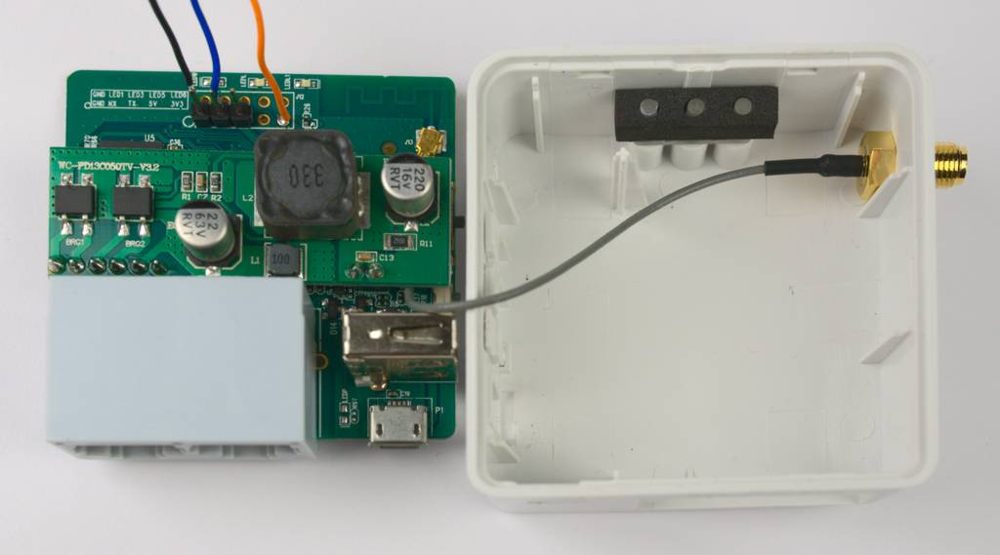

# GL-AR150

As we only listen to the RS485-Bus we can use the internal serial interface of the GL-AR150.



In this example the cables are directly connected to the pcb:

* black = ground
* blue = RX
* orange = 3.3V


## Setup

*This description is only one possible setup and a documentation of my own
personal setup, other configurations (uplink via WLAN, etc) are possible*

Install OpenWrt as described in the [official
documentation](https://openwrt.org/toh/gl.inet/gl-ar150).

In order to be able to use the built in serial lines (as shown in the photo
above) one needs to disable the standard serial console on the serial port.
Please [follow the official
documentation](https://openwrt.org/docs/guide-user/hardware/terminate.console.on.serial)
on this.

```
connections:
WAN -> local lan
LAN -> PowerRouter
config:
interfaces:
  lan:
    protocol: static address
    use custom DNS servers -> local router
    activate dhcp server # give PowerRouter an ip address
  wan:
    protocol: DHCP
    # assign a static address on you local lan
  wwan:
    bring up on boot: false # don't use wifi
hostnames:
  logging1.powerrouter.com -> our static lan address
dhcp and dns:
  set an infinite lease time for the powerrouter so the ip does not change
firewall:
  port forwards:
    # the PowerRouter thinks logging1.powerrouter.com is this device, so we need
    # to redirect the traffic on port 80 to the prpd http port
    protocol: TCP
    source zone: lan
    external port: 80
    destination zone: lan
    internal ip address: our static lan address
    internal port: 8000 # this is where prpd http listens
    external ip address: our static lan address
  traffic rules:
    from "wan" to "this device" port 22 # allow ssh from wan
    from "wan" to "this device" port 8091-8092 # allow prometheus from wan
    from "wan" to "this device" port 9100 # prometheus node exporter
```

`/etc/init.d/prpd_serial`

``` bash
#!/bin/sh /etc/rc.common

USE_PROCD=1

START=95
STOP=01

start_service() {
    procd_open_instance
    procd_set_param command /root/prpd
    procd_set_param env PRPD_ACTION=serial PRPD_SERIAL_PORT=/dev/ttyUSB0 PRPD_OUTPUT_HASS_MQTT_URI=tcp://mqtt-broker.local:1883/ PRPD_OUTPUT_HASS_ACTIVE=1 PRPD_OUTPUT_PROM_ACTIVE=1 PRPD_OUTPUT_PROM_PORT=8092
    procd_set_param stdout 1
    procd_set_param stderr 1
    # when within 60 seconds after inital start,
    # wait 10 seconds before restarting,
    # retry 99 times, then give up
    procd_set_param respawn 60 10 99
    procd_close_instance
}
```


## Building

```bash
cd dev
bash download_openwrt_sdk.sh
cd ..
bash dev/build.sh
```
